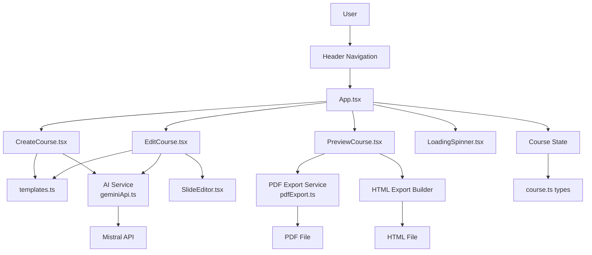
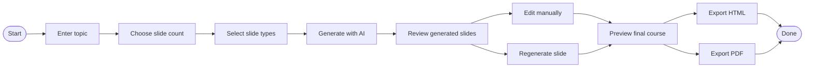

# AI Course Builder

AI Course Builder is a React + TypeScript application that turns a topic into a draft learning module with the help of AI. Instead of starting from a blank page, a user chooses a topic, defines a slide structure, generates content, refines each slide, previews the result, and exports the course as HTML or PDF.

This project is built as a lightweight frontend prototype focused on speed of iteration, structured AI output, and human-in-the-loop editing.

## Why This Project Exists

Creating a short course or internal learning deck is repetitive work. Most of the effort is not in writing from scratch, but in organizing the content into a usable teaching flow:

- introduction
- explanation
- knowledge check
- summary

AI Course Builder reduces that setup time. It gives users a strong first draft while keeping final control in human hands.

## What the App Does

The application is organized around a simple 3-step workflow:

1. Create a course
2. Edit and refine slides
3. Preview and export the final output

### Core capabilities

- Enter a course topic and slide count
- Select the type of each slide
- Generate slide content with AI
- Edit slides manually
- Regenerate individual slides
- Add or remove slides
- Preview the full course in-app
- Export as HTML
- Export as PDF

## Architecture Diagram



## User Flow Diagram



## Demo Flow

The current product experience works like this:

1. The user enters a topic such as `Introduction to Machine Learning`.
2. The user chooses how many slides they want.
3. The app pre-fills slide types with a default pattern:
   - first slide: `title`
   - last slide: `summary`
   - middle slides: `content`
4. The user can change any slide type before generation.
5. The app calls the AI service and generates slide content.
6. The user reviews the generated course in the editor.
7. The user can manually update the content or regenerate weak slides.
8. The final course can be exported as HTML or PDF.

## Tech Stack

### Frontend

- React 18
- TypeScript
- Vite
- Tailwind CSS
- Lucide React

### AI and export

- Mistral Chat Completions API
- jsPDF

### Tooling

- ESLint
- PostCSS

## Architecture Overview

This is currently a frontend-only application. There is no active backend, authentication layer, or persistence layer in the current implementation.

At a high level:

- `src/App.tsx` manages the active tab and in-memory course state
- `src/components/CreateCourse.tsx` handles course setup and initial generation
- `src/components/EditCourse.tsx` handles refinement and slide actions
- `src/components/SlideEditor.tsx` provides type-specific editing controls
- `src/components/PreviewCourse.tsx` handles preview and export actions
- `src/services/geminiApi.ts` contains the AI request/response logic
- `src/services/pdfExport.ts` generates a printable PDF from the course model
- `src/types/course.ts` defines the core data model

## Project Structure

```text
.
├── src/
│   ├── components/
│   │   ├── CreateCourse.tsx
│   │   ├── EditCourse.tsx
│   │   ├── Header.tsx
│   │   ├── LoadingSpinner.tsx
│   │   ├── PreviewCourse.tsx
│   │   └── SlideEditor.tsx
│   ├── data/
│   │   └── templates.ts
│   ├── services/
│   │   ├── geminiApi.ts
│   │   └── pdfExport.ts
│   ├── types/
│   │   └── course.ts
│   ├── App.tsx
│   ├── index.css
│   └── main.tsx
├── index.html
├── package.json
└── vite.config.ts
```

## Data Model

The app is built around a strongly typed course structure.

### Course

A course contains:

- `id`
- `title`
- `topic`
- `createdAt`
- `slides`

### Slide

Each slide contains:

- `id`
- `type`
- `title`
- `content`
- `order`

### Supported slide types

- `title`
- `content`
- `quiz`
- `summary`

This structure is important because the app does not treat AI output as one large block of text. It treats content as typed data, which makes editing, rendering, and exporting much more reliable.

## AI Integration

The app currently uses Mistral for content generation.

### Environment variables

Create a `.env` file in the project root with:

```env
VITE_MISTRAL_API_KEY=your_api_key_here
VITE_MISTRAL_MODEL=mistral-small-latest
```

### How generation works

The AI service:

- reads the API key and model from environment variables
- sends a prompt to Mistral's chat completions endpoint
- asks for JSON output
- parses the returned JSON string
- maps that data into the course model used by the UI

### Prompting strategy

The app requests structured JSON instead of free-form content. That is a deliberate design choice. It allows the UI to treat the response as predictable slide data instead of trying to interpret arbitrary text.

Initial generation currently works slide-by-slide. During this phase:

- `quiz` slides use a quiz-oriented prompt
- `summary` slides use a summary-oriented prompt
- `title` and `content` slide creation currently share the same content-generation path

This keeps the implementation simple, but it also means initial title-slide generation is less specialized than it could be.

## Export Features

### HTML export

The app can generate a standalone HTML file in the browser. This is useful for:

- lightweight sharing
- opening the course without running the app
- creating a portable course artifact

### PDF export

The app can also generate a PDF using `jsPDF`. The export service:

- creates a title page
- adds content slide-by-slide
- handles text wrapping
- inserts new pages when needed

## Getting Started

### Prerequisites

- Node.js 18+ recommended
- npm
- A valid Mistral API key

### Installation

```bash
npm install
```

### Run locally

```bash
npm run dev
```

The app will usually start at:

```text
http://localhost:5173
```

### Build for production

```bash
npm run build
```

### Preview the production build

```bash
npm run preview
```

### Lint the codebase

```bash
npm run lint
```

## How the Main Screens Work

### 1. Create

`CreateCourse.tsx` is responsible for:

- collecting the topic
- collecting the number of slides
- allowing users to customize slide types
- generating the initial course

### 2. Edit

`EditCourse.tsx` lets users:

- edit a slide
- regenerate a slide with AI
- add a new slide
- remove an existing slide

This is where the human-in-the-loop model becomes most visible. AI creates the first draft, but the user shapes the final output.

### 3. Preview

`PreviewCourse.tsx` lets users:

- move through the generated slides
- review the course as a learner would
- export the course as HTML or PDF

## Design Philosophy

This project is opinionated in a few ways:

- AI should accelerate drafting, not replace review
- structured output is better than raw text for product workflows
- users should always be able to override AI output
- the workflow should feel simple enough for non-technical users

## Who This Project Is For

This project is a good fit for:

- educators creating short lessons
- internal training teams
- founders prototyping learning products
- content creators building quick course drafts
- recruiters or interviewers reviewing AI-assisted product work

## License

No license file is currently included in this repository. Add one before distributing or open-sourcing the project.
